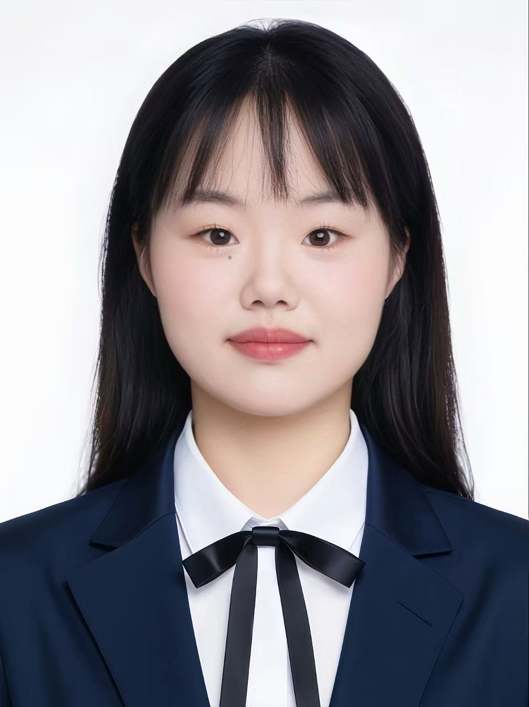
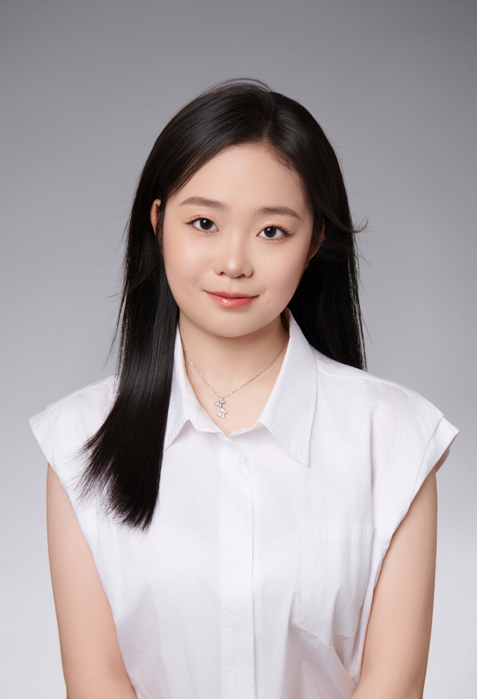
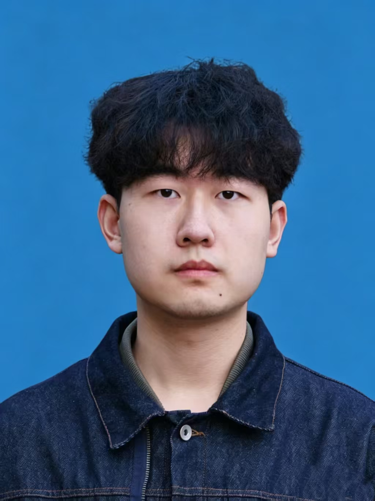
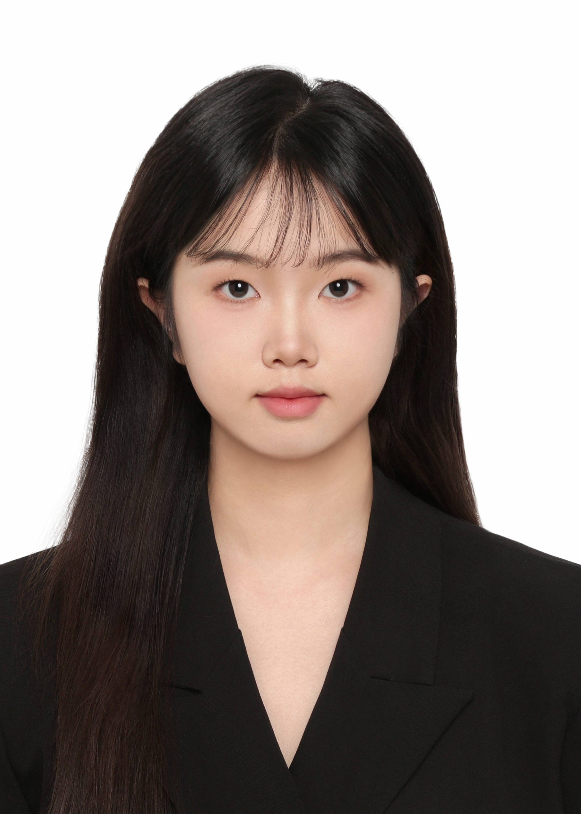
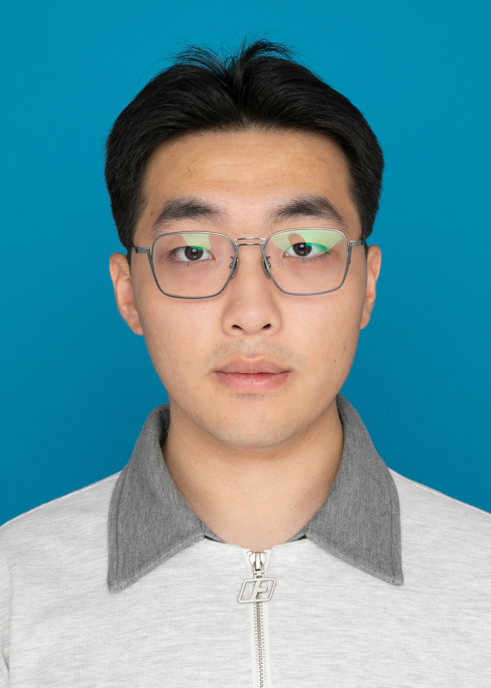
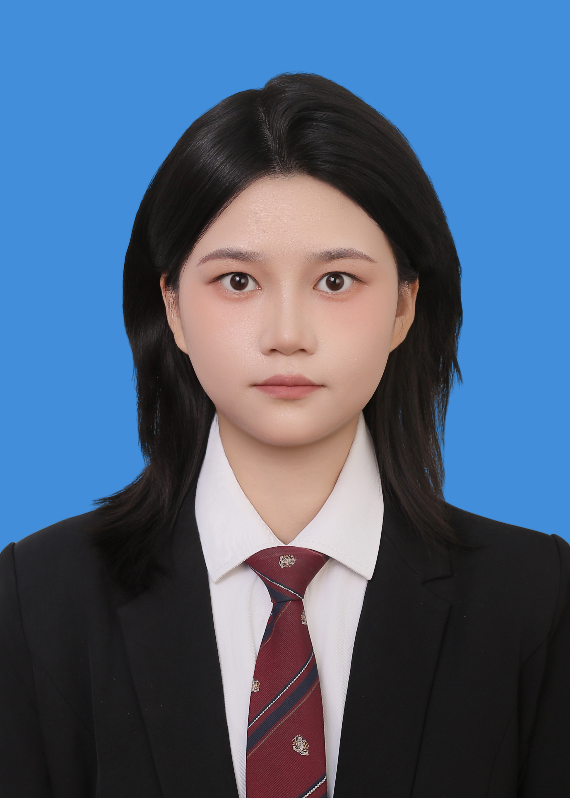

## (Future) PhD Students

::: {.grid}

::: {.g-col-12 .g-col-md-6}
::: {.profile-card}
{.profile-photo}

### Wang, Hui (王慧) 

2027–Present

Wang Hui will join the group in 2027.
:::
:::

::: {.g-col-12 .g-col-md-6}
::: {.profile-card}
{.profile-photo}

### Liu, Xinyue (刘馨月)

2027–Present

Liu Xinyue will join the group in 2027.
:::
:::

:::

## Master Students

::: {.grid}

::: {.g-col-12 .g-col-md-6}
::: {.profile-card}
{.profile-photo}

### Chen, Xiangding (陈相锭)

2026–Present

Research direciton: TBD
:::
:::

::: {.g-col-12 .g-col-md-6}
::: {.profile-card}
{.profile-photo}

### Zhang, Yaran (张雅然)

2026–Present

Research direciton: TBD
:::
:::

::: {.g-col-12 .g-col-md-6}
::: {.profile-card}
{.profile-photo}

### Zeng, Zirun (曾子润)

2026–Present

Research direciton: TBD
:::
:::

::: {.g-col-12 .g-col-md-6}
::: {.profile-card}
{.profile-photo}

### Dang, Yuwei (党钰薇)

2026–Present

Research direciton: TBD
:::
:::

:::

## Undergrad Students
