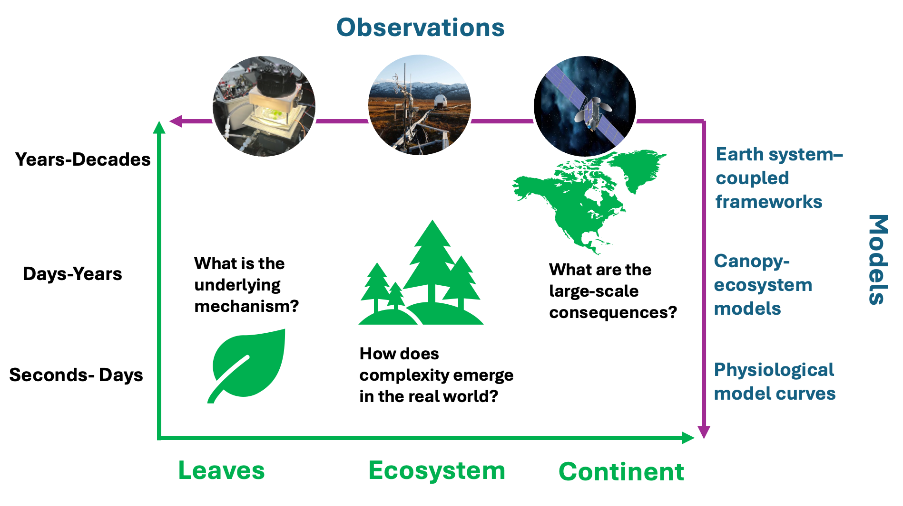
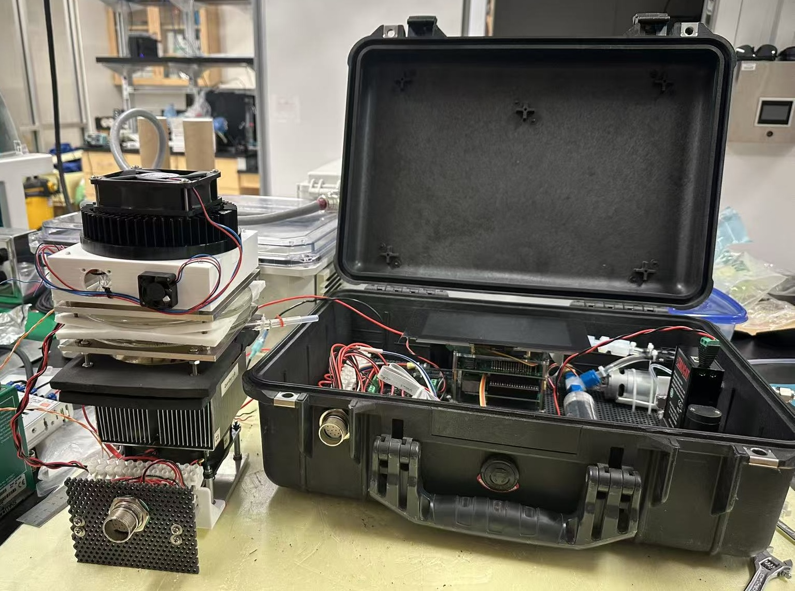
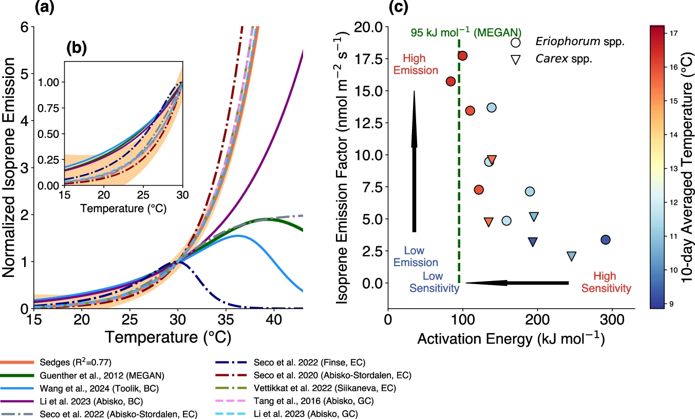
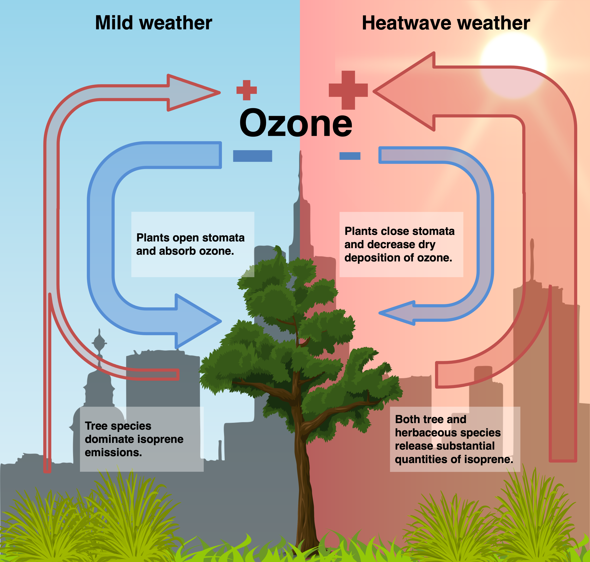
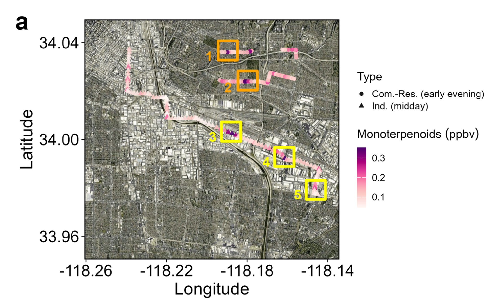

  

Ecosystems release and take up reactive gases, including volatile organic compounds (VOCs), reactive nitrogen species, sulfur compounds, and halogens, linking biological processes from leaves to ecosystems and the atmosphere. Our research combines laboratory experiments, field observations, satellite data, numerical modeling, and data analysis to understand biosphere–atmosphere exchange across scales from seconds to decades and from leaves to continents. By connecting physiological measurements, canopy–ecosystem models, and Earth system frameworks, we aim to reveal the mechanisms controlling reactive trace gas exchange, understand how ecosystem-level complexity emerges in the real world, and assess its broader consequences for atmospheric chemistry, air quality, and climate.

## BVOC measurements in the laboratory environment

We use leaf chambers to understand the physiological responses of BVOC emissions to different controlling factors, including light, temperature, and environmental stresses, which form the basis for understanding the behavior of vegetation in response to global environmental change.

::: {layout="[[45, 55]]"}

:::

**Reference**

1. **Wang, H.**, Welch, A. M., Nagalingam, S., Leong, C., Czimczik, C. I., Tang, J., Seco, R., Rinnan, R., Vettikkat, L., Schobesberger, S., et al. High temperature sensitivity of Arctic isoprene emissions explained by sedges. *Nature Communications*, 15(1), 6144.
2. **Wang, H.**, Welch, A., Nagalingam, S., Leong, C., Kittitananuvong, P., Barsanti, K. C., Sheesley, R. J., Czimczik, C. I., and Guenther, A. B. Arctic heatwaves could significantly influence the isoprene emissions from shrubs. *Geophysical Research Letters*, 51(2), e2023GL107599.

## Environmental change and air quality

Rapid environmental changes (e.g., climate change, land-use change, and anthropogenic emissions) could reshape urban air quality. We aim to understand the role of the biosphere in this process, specifically how biospheric changes and responses affect both ozone and particles.

::: {layout="[[39, 61]]"}

:::

**Reference**

1. **Wang, H.**, Nagalingam, S., Welch, A. M., Leong, C., Czimczik, C. I., and Guenther, A. B. Heat waves may trigger unexpected surge in aerosol and ozone precursor emissions from sedges in urban landscapes. *Proceedings of the National Academy of Sciences*, 121(45), e2412817121.
2. Zhang, Y., Wu, K., **Wang, H.^*^**, Pfannerstill, E. Y., Nagalingam, S., Coggon, M. M., Stockwell, C., Ruiz, M. V., Ho, C., Yu, Y., et al. Reconciling observed and modeled estimates of urban terpenoid emissions. (Accepted by *Nature Communications*, corresponding author)

## BVOC emissions and climate

Changes in BVOC emissions can disturb tropospheric chemistry and affect the concentrations of OH, ozone, and aerosols, which in turn influences climate. We aim to elucidate the role of BVOCs in the climate system by integrating field measurements with climate modeling via the Community Earth System Model (CESM).

::: {.HB_stress}

:::
**Reference**

1. Tang, J., **Wang, H.^*^**, Li, T., Cai, Z., Guenther, A., Olsson, P.-O., Schurgers, G., Rieksta, J., He, C., Tang, W., et al. Moth Effect: Herbivore-induced plant volatiles disturb weather patterns. （Under review in Science Advances, co-first and corresponding author）
2. **Wang, H.**, Lu, X., Seco, R., Stavrakou, T., Karl, T., Jiang, X., Gu, L., and Guenther, A. B. Modeling isoprene emission response to drought and heatwaves within MEGAN using evapotranspiration data and by coupling with the community land model. *Journal of Advances in Modeling Earth Systems*, 14(12), e2022MS003174.
3. **Wang, H.**, Wu, Q., Guenther, A. B., Yang, X., Wang, L., Xiao, T., Li, J., Feng, J., Xu, Q., and Cheng, H. A long-term estimation of biogenic volatile organic compound (BVOC) emission in China from 2001–2016: The roles of land cover change and climate variability. *Atmospheric Chemistry and Physics*, 21(6), 4825–4848.
